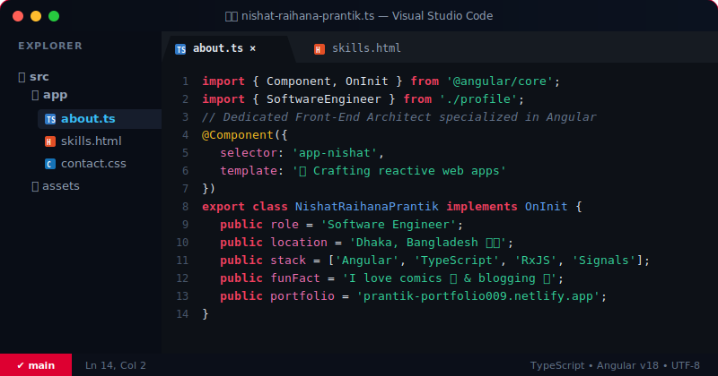

  <!-- Interactive IDE Mockup Header -->
  

 

  

---

### 🚀 About Me
- 💻 **Software Engineer** specializing in the Angular ecosystem, building high-performance, reactive, and scalable front-end experiences.
- ⚙️ Passionate about clean architecture design patterns, **RxJS declarative streams**, and **Angular Signals**.
- ✍️ Technical writer sharing front-end stories on **[Medium](https://medium.com/@nishatraihana009)**.
- ⚡ Fun Fact: I have an endless love for reading comics! 📚

---

### 🛠️ Tech Stack & Toolkit

  <table>
    <tr>
      <td align="center" width="200"><b>Frontend &amp; Core</b></td>
      <td>
        
        
        
        
        
        
      </td>
    </tr>
    <tr>
      <td align="center"><b>Styling &amp; Design</b></td>
      <td>
        
        
        
        
        
        
        
      </td>
    </tr>
    <tr>
      <td align="center"><b>Backend &amp; DB</b></td>
      <td>
        
        
        
      </td>
    </tr>
    <tr>
      <td align="center"><b>Tools &amp; Testing</b></td>
      <td>
        
        
        
        
      </td>
    </tr>
  </table>

---

### 🤝 Let's Connect!

I'm always open to talking about web performance, Angular architectures, open source, or comics. Reach out to me:

  
  
  
  
  

 

*   🌐 Check out my digital playground / portfolio: [prantik-portfolio009.netlify.app](https://prantik-portfolio009.netlify.app/)
*   📝 Read my technical articles on Medium: [@nishatraihana009](https://medium.com/@nishatraihana009)
*   📄 Download / View my Resume: [Google Drive](https://drive.google.com/file/d/1_o2fpLilesBeTK0mZzblTM7ED_poonGo/view?usp=sharing)
